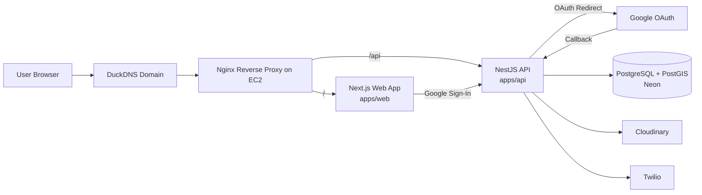

# ResQ

ResQ is a disaster-response platform built for Sri Lanka to connect victims and nearby volunteers quickly during floods, landslides, and other emergencies.

Developed as a solo third-year project at the University of Sri Jayawardenapura.


[](https://resq-disaster-platform-web.vercel.app)
[](https://github.com/nishmikaeka/resq-disaster-platform)

---

## Table of Contents

- [Motivation](#motivation)
- [What Problem It Solves](#what-problem-it-solves)
- [How It Works](#how-it-works)
- [Key Features](#key-features)
- [Tech Stack](#tech-stack)
- [Architecture Overview](#architecture-overview)
- [Project Structure](#project-structure)
- [Getting Started](#getting-started)
- [Environment Variables](#environment-variables)
- [Run and Test](#run-and-test)
- [Testing & Quality Assurance](#testing--quality-assurance)
- [Production Notes](#production-notes)
- [Product and Engineering Decisions](#product-and-engineering-decisions)
- [Infrastructure Snapshot](#infrastructure-snapshot)
- [Architecture Diagram](#architecture-diagram)
- [Roadmap](#roadmap)
- [Contributing](#contributing)
- [Credits](#credits)
- [License](#license)

---

## Motivation

During disasters, emergency hotlines can become overloaded. ResQ was built to provide a direct, map-based path between victims and volunteer responders, reducing response time and coordination friction.

---

## What Problem It Solves

- Victims can share their exact location, urgency, and media evidence quickly.
- Volunteers can discover nearby active incidents and accept response tasks.
- Victims receive SMS confirmation when help is on the way.

---

## How It Works

### Victim Flow

1. Sign in with Google.
2. Create an incident (title, location, urgency, phone, optional media).
3. Wait for nearby volunteer acceptance.
4. Mark incident as resolved when safe.

### Volunteer Flow

1. Sign in and open dashboard.
2. View nearby incidents on map and list.
3. Accept an open incident.
4. Coordinate with victim and complete response.

---

## Key Features

- Role-based experience for `VICTIM` and `VOLUNTEER`.
- Geospatial discovery with PostgreSQL + PostGIS.
- Live map interaction with draggable markers (Mapbox).
- Incident media upload support (Cloudinary).
- Twilio SMS notification when an incident is accepted.
- Secure cookie-based authentication with token refresh flow.
- Health checks with database integration (`@nestjs/terminus`).
- **Performance & Security:** In-memory response caching, global rate limiting, and security headers (`helmet`).
- **Resiliency:** Global exception filtering, strict validation pipes, and cleanup cron.

---

## Tech Stack

| Layer        | Technology                                           |
| ------------ | ---------------------------------------------------- |
| Frontend     | Next.js 16, React 19, Tailwind CSS, Mapbox GL, Axios |
| Backend      | NestJS 11, Prisma, PostgreSQL (Neon), PostGIS, Throttler, Cache Manager |
| Integrations | Google OAuth, Twilio, Cloudinary                     |
| Monorepo     | Turborepo + npm workspaces                           |
| Deployment   | AWS EC2 + Nginx + DuckDNS                            |

---

## Architecture Overview

- `apps/web` — UI, incident reporting, dashboards, map experience.
- `apps/api` — auth, incidents, users, health, security, and background jobs.
- `packages/database` — Prisma schema/client generation and migrations.

---

## Project Structure


---

## Getting Started

### Prerequisites

- Node.js `>=18`
- npm `>=10`
- PostgreSQL database with PostGIS enabled

### Installation

```bash
git clone https://github.com/nishmikaeka/resq-disaster-platform.git
cd resq-disaster-platform
npm install
```

---

## Environment Variables

Create:

- `apps/web/.env.local`
- `apps/api/.env`

### `apps/web/.env.local`

```env
NEXT_PUBLIC_API_URL=http://localhost:3001/api
NEXT_PUBLIC_BACKEND_URL=http://localhost:3001
NEXT_PUBLIC_MAPBOX_TOKEN=your_mapbox_public_token

# Optional — only if used by your current frontend auth flow
NEXTAUTH_SECRET=your_nextauth_secret
NEXTAUTH_URL=http://localhost:3000

# Optional — only if referenced in frontend code
NEXT_PUBLIC_CLOUDINARY_CLOUD_NAME=your_cloudinary_cloud_name
NEXT_PUBLIC_CLOUDINARY_API_KEY=your_cloudinary_api_key
```

### `apps/api/.env`

```env
PORT=3001
NODE_ENV=development
FRONTEND_URL=http://localhost:3000
BACKEND_URL=http://localhost:3001
SESSION_SECRET=your_long_random_session_secret
JWT_SECRET=your_long_random_jwt_secret

DATABASE_URL=your_postgres_connection_string

GOOGLE_CLIENT_ID=your_google_client_id
GOOGLE_CLIENT_SECRET=your_google_client_secret
CLOUDINARY_CLOUD_NAME=your_cloudinary_cloud_name
CLOUDINARY_API_KEY=your_cloudinary_api_key
CLOUDINARY_API_SECRET=your_cloudinary_api_secret

TWILIO_ACCOUNT_SID=your_twilio_sid
TWILIO_AUTH_TOKEN=your_twilio_auth_token
TWILIO_PHONE_NUMBER=+1xxxxxxxxxx
```

### Production Values (EC2 + DuckDNS + Nginx)

```env
# apps/api/.env
NODE_ENV=production
PORT=3001
FRONTEND_URL=https://your-domain.duckdns.org
BACKEND_URL=https://your-domain.duckdns.org
```

```env
# apps/web/.env.local (or .env.production)
NEXT_PUBLIC_BACKEND_URL=https://your-domain.duckdns.org
NEXT_PUBLIC_API_URL=https://your-domain.duckdns.org/api
```

> Keep real secrets out of version control. Restart API with `pm2 restart resq-api --update-env` after API env changes. Rebuild web after any `NEXT_PUBLIC_*` changes.

---

## Run and Test

### Run Both Apps from Monorepo Root

```bash
npm run dev
```

### Run Only API

```bash
npm run start:dev --workspace=apps/api
```

### Run Only Web

```bash
npm run dev --workspace=apps/web
```

### Run API Tests

```bash
npm run test --workspace=apps/api
```

---

## Testing & Quality Assurance

ResQ follows a rigorous testing strategy to ensure reliability during high-stress disaster scenarios.

### Integration & Logic Testing (Jest)

The backend includes a focused test suite covering critical business logic and edge cases specific to emergency-response workflows.

| Test Scenario                 | What Is Verified                                                                                          |
| ----------------------------- | --------------------------------------------------------------------------------------------------------- |
| **Race condition prevention** | Multiple volunteers cannot simultaneously accept the same incident — enforced via atomic database updates |
| **State integrity**           | `RESOLVED` incidents cannot be re-accepted by any volunteer                                               |
| **Geospatial edge cases**     | Out-of-bounds coordinates (e.g., `0, 0`) return empty results without system failure                      |
| **Data type accuracy**        | High-precision PostGIS coordinates are correctly mapped to numerical types for frontend map rendering     |

```bash
npm run test --workspace=apps/api
```

### Performance & Stress Testing (k6)

The API was subjected to a high-concurrency stress test to validate platform stability for real-world usage in Sri Lanka.

| Metric                   | Result                                                 |
| ------------------------ | ------------------------------------------------------ |
| Concurrent virtual users | 100                                                    |
| HTTP success rate        | 100% — zero failures across 3,600+ requests            |
| Throughput               | ~33 req/s — validated for rapid incident volume spikes |
| P95 latency              | 2.04 s — reliable under sustained heavy load           |

**Key finding:** Stress testing confirmed that application logic scales well under load. The primary bottleneck under extreme concurrency is the AWS EC2 `t3.micro` instance (1 GB RAM), which approaches CPU saturation during concurrent JWT validation and PostGIS spatial indexing. This data directly informs the roadmap items for horizontal scaling and Redis caching.

---

## Production Notes

- **Authentication:** Uses `HttpOnly` cookies for access and refresh tokens.
- **Security Hardening:** Global security headers applied via `helmet`. CORS configured for specific production origins.
- **Rate Limiting:** Global throttling enabled via `@nestjs/throttler` to prevent abuse.
- **Response Caching:** In-memory caching implemented for performance-heavy routes (e.g., nearby incidents) using `@nestjs/cache-manager`.
- **Validation:** Strict global `ValidationPipe` (whitelist and auto-transform) ensures data integrity.
- **Error Handling:** Centralized `GlobalExceptionFilter` for consistent API errors and focused server-side logging.
- **Health Monitoring:** Health endpoint available at `/api/health` with Prisma connectivity checks.
- **Data Hygiene:** A daily cron job removes incidents older than 7 days to keep database queries efficient.
- **Secrets:** Use strong, unique values for `SESSION_SECRET` and `JWT_SECRET`.

---

## Product and Engineering Decisions

**Fast sign-up under stress:** Google OAuth reduces friction so users can join quickly during an active emergency.

**Dark-first interface:** The dashboard uses a dark visual style for clearer map contrast at night and lower perceived battery drain on AMOLED devices.

**Geo-first incident discovery:** Nearby incidents are resolved using PostGIS location-based queries on PostgreSQL, minimising irrelevant results and response latency.

**Scalable API protection:** Rate limiting (`@nestjs/throttler`) prevents abuse and accidental request storms during high-traffic disaster events.

**Automatic data hygiene:** A scheduled cleanup job removes stale incidents to keep feeds relevant and database queries efficient.

**Production traffic routing:** Nginx acts as a reverse proxy and process boundary for routing between the web app and API on a single EC2 instance.

**Stable public endpoint:** DuckDNS provides a persistent domain mapped to the EC2 public IP, enabling reliable OAuth callbacks and API access.

---

## Infrastructure Snapshot

| Component              | Detail                                                                                                              |
| ---------------------- | ------------------------------------------------------------------------------------------------------------------- |
| **Compute**            | Single AWS EC2 instance hosting both `apps/web` and `apps/api`                                                      |
| **Process management** | PM2 keeps services running with auto-restart and zero-downtime reload                                               |
| **Reverse proxy**      | Nginx routes `https://<domain>/` → Next.js web app and `https://<domain>/api` → NestJS API; handles SSL termination |
| **Domain**             | DuckDNS dynamic DNS maps a persistent domain to the EC2 public IP                                                   |
| **Database**           | PostgreSQL (Neon) with PostGIS for geospatial capabilities                                                          |

---

## Architecture Diagram


```mermaid
flowchart LR
    U[User Browser]
    D[DuckDNS Domain]
    N[Nginx Reverse Proxy on EC2]
    W[Next.js Web App\napps/web]
    A[NestJS API\napps/api]
    P[(PostgreSQL + PostGIS\nNeon)]
    C[Cloudinary]
    T[Twilio]
    G[Google OAuth]

    U --> D --> N
    N -->|/| W
    N -->|/api| A

    W -->|Google Sign-In| A
    A -->|OAuth Redirect| G
    G -->|Callback| A

    A --> P
    A --> C
    A --> T
```

---

## Roadmap

- Push notifications for responders
- Sinhala/Tamil localization
- AI-assisted triage and prioritization
- Admin dashboard and analytics
- Redis-based horizontal scaling for caching and sessions
- Offline-friendly fallback flows

---

## Contributing

Contributions are welcome.

1. Fork the repository.
2. Create a feature branch.
3. Commit changes with clear, descriptive messages.
4. Open a pull request with a concise description and test steps.

---

## Credits

- **Project author:** Nishmika Ekanayake
- Built for academic research and social impact in disaster-response workflows.
- Thanks to the open-source ecosystem around NestJS, Next.js, Prisma, and Mapbox.

---

## License

This project is currently unlicensed (`UNLICENSED`).
If you plan to open-source it formally, choose a license at [choosealicense.com](https://choosealicense.com/).
