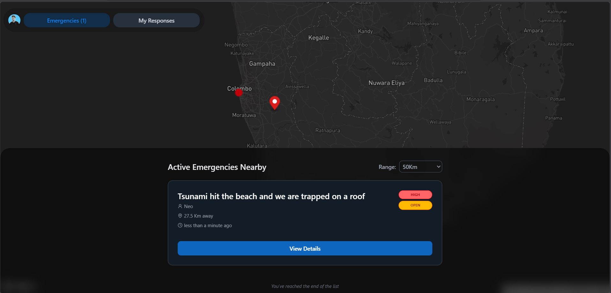
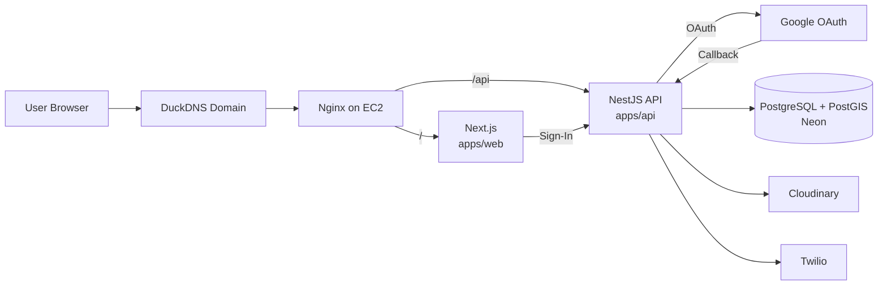

<div align="center">



# ResQ

_Real-time disaster response platform for Sri Lanka — connecting victims and volunteers during floods, landslides, and emergencies._

[](https://resq-disaster-platform-web.vercel.app)
[](https://github.com/nishmikaeka/resq-disaster-platform)


_Solo third-year project · University of Sri Jayawardenapura_

</div>

---

## Table of Contents

- [Motivation](#motivation)
- [What It Solves](#what-it-solves)
- [How It Works](#how-it-works)
- [Key Features](#key-features)
- [Tech Stack](#tech-stack)
- [Architecture Overview](#architecture-overview)
- [Project Structure](#project-structure)
- [Getting Started](#getting-started)
- [Environment Variables](#environment-variables)
- [Run and Test](#run-and-test)
- [Testing & Quality Assurance](#testing--quality-assurance)
- [Production Notes](#production-notes)
- [Engineering Decisions](#engineering-decisions)
- [Infrastructure Snapshot](#infrastructure-snapshot)
- [Architecture Diagram](#architecture-diagram)
- [Roadmap](#roadmap)
- [Contributing](#contributing)
- [Credits](#credits)
- [License](#license)

---

## Motivation

During disasters, emergency hotlines become overloaded and coordination breaks down. ResQ provides a direct, map-based path between victims and volunteer responders — reducing response time and friction when it matters most.

---

## What It Solves

| Problem                        | ResQ Solution                                |
| ------------------------------ | -------------------------------------------- |
| Overwhelmed emergency hotlines | Decentralized volunteer dispatch             |
| Slow victim-responder matching | Geospatial proximity discovery via PostGIS   |
| No confirmation for victims    | Twilio SMS when a volunteer accepts          |
| No media evidence support      | Cloudinary media upload on incident creation |

---

## How It Works

**Victim Flow**

1. Sign in with Google
2. Create an incident — title, location, urgency, phone, optional media
3. Wait for a nearby volunteer to accept
4. Mark the incident as resolved when safe

**Volunteer Flow**

1. Sign in and open the dashboard
2. Browse nearby incidents on the live map and list view
3. Accept an open incident
4. Coordinate with the victim and complete the response

---

## Key Features

| Feature                  | Details                                            |
| ------------------------ | -------------------------------------------------- |
| **Role-based access**    | Separate flows for `VICTIM` and `VOLUNTEER`        |
| **Geospatial discovery** | Nearby incidents via PostgreSQL + PostGIS          |
| **Live map interaction** | Draggable markers powered by Mapbox GL             |
| **Media upload**         | Incident photo/video evidence via Cloudinary       |
| **SMS notifications**    | Twilio alert sent to victim when volunteer accepts |
| **Secure auth**          | `HttpOnly` cookie-based tokens with refresh flow   |
| **Rate limiting**        | Global throttling via `@nestjs/throttler`          |
| **Response caching**     | In-memory cache on performance-heavy routes        |
| **Data hygiene**         | Daily cron removes incidents older than 7 days     |
| **Health checks**        | `/api/health` with live Prisma connectivity check  |

---

## Tech Stack

| Layer            | Technology                                                              |
| ---------------- | ----------------------------------------------------------------------- |
| **Frontend**     | Next.js 16, React 19, Tailwind CSS, Mapbox GL, Axios                    |
| **Backend**      | NestJS 11, Prisma, PostgreSQL (Neon), PostGIS, Throttler, Cache Manager |
| **Integrations** | Google OAuth, Twilio, Cloudinary                                        |
| **Monorepo**     | Turborepo + npm workspaces                                              |
| **Deployment**   | AWS EC2 + Nginx + DuckDNS + PM2                                         |

---

## Architecture Overview

- `apps/web` — UI, incident reporting, dashboards, map experience (Next.js)
- `apps/api` — Auth, incidents, users, health, security, background jobs (NestJS)
- `packages/database` — Prisma schema, client generation, and migrations

---

## Project Structure


```
resq-disaster-platform/
├── apps/
│   ├── web/                    # Next.js frontend
│   │   ├── app/                # App router pages and layouts
│   │   ├── components/         # Shared UI components
│   │   ├── public/             # Static assets
│   │   └── .env.local
│   └── api/                    # NestJS backend
│       ├── src/
│       │   ├── auth/           # Google OAuth, JWT, cookie strategy
│       │   ├── incidents/      # Incident CRUD, geospatial queries
│       │   ├── users/          # User roles and profile
│       │   ├── health/         # Health check endpoint
│       │   └── common/         # Guards, filters, pipes, cron jobs
│       └── .env
└── packages/
    └── database/               # Prisma schema, client, migrations
```

---

## Getting Started

**Prerequisites:** Node.js `>=18`, npm `>=10`, PostgreSQL with PostGIS enabled

```bash
git clone https://github.com/nishmikaeka/resq-disaster-platform.git
cd resq-disaster-platform
npm install
```

---

## Environment Variables

### `apps/web/.env.local`

```env
NEXT_PUBLIC_API_URL=http://localhost:3001/api
NEXT_PUBLIC_BACKEND_URL=http://localhost:3001
NEXT_PUBLIC_MAPBOX_TOKEN=your_mapbox_public_token

# Optional
NEXTAUTH_SECRET=your_nextauth_secret
NEXTAUTH_URL=http://localhost:3000
NEXT_PUBLIC_CLOUDINARY_CLOUD_NAME=your_cloudinary_cloud_name
NEXT_PUBLIC_CLOUDINARY_API_KEY=your_cloudinary_api_key
```

### `apps/api/.env`

```env
PORT=3001
NODE_ENV=development
FRONTEND_URL=http://localhost:3000
BACKEND_URL=http://localhost:3001
SESSION_SECRET=your_long_random_session_secret
JWT_SECRET=your_long_random_jwt_secret
DATABASE_URL=your_postgres_connection_string
GOOGLE_CLIENT_ID=your_google_client_id
GOOGLE_CLIENT_SECRET=your_google_client_secret
CLOUDINARY_CLOUD_NAME=your_cloudinary_cloud_name
CLOUDINARY_API_KEY=your_cloudinary_api_key
CLOUDINARY_API_SECRET=your_cloudinary_api_secret
TWILIO_ACCOUNT_SID=your_twilio_sid
TWILIO_AUTH_TOKEN=your_twilio_auth_token
TWILIO_PHONE_NUMBER=+1xxxxxxxxxx
```

### Production (EC2 + DuckDNS + Nginx)

```env
# apps/api/.env
NODE_ENV=production
FRONTEND_URL=https://your-domain.duckdns.org
BACKEND_URL=https://your-domain.duckdns.org
```

```env
# apps/web/.env.local
NEXT_PUBLIC_BACKEND_URL=https://your-domain.duckdns.org
NEXT_PUBLIC_API_URL=https://your-domain.duckdns.org/api
```

> Keep secrets out of version control. Run `pm2 restart resq-api --update-env` after API env changes. Rebuild web after any `NEXT_PUBLIC_*` changes.

---

## Run and Test

```bash
npm run dev                                    # both apps
npm run start:dev --workspace=apps/api         # API only
npm run dev --workspace=apps/web               # web only
npm run test --workspace=apps/api              # API tests
```

---

## Testing & Quality Assurance

### Integration Tests (Jest)

| Scenario                      | What Is Verified                                                                                    |
| ----------------------------- | --------------------------------------------------------------------------------------------------- |
| **Race condition prevention** | Multiple volunteers cannot simultaneously accept the same incident — enforced via atomic DB updates |
| **State integrity**           | `RESOLVED` incidents cannot be re-accepted by any volunteer                                         |
| **Geospatial edge cases**     | Out-of-bounds coordinates (e.g., `0, 0`) return empty results without system failure                |
| **Data type accuracy**        | High-precision PostGIS coordinates correctly map to numerical types for map rendering               |

### Performance & Stress Testing (k6)

| Metric                   | Result                                      |
| ------------------------ | ------------------------------------------- |
| Concurrent virtual users | 100                                         |
| HTTP success rate        | 100% — zero failures across 3,600+ requests |
| Throughput               | ~33 req/s                                   |
| P95 latency              | 2.04s under sustained heavy load            |

> The primary bottleneck under extreme concurrency is the `t3.micro` (1 GB RAM) approaching CPU saturation during JWT validation and PostGIS spatial indexing. This directly informs the Redis and horizontal scaling roadmap items.

---

## Production Notes

| Concern               | Implementation                                                        |
| --------------------- | --------------------------------------------------------------------- |
| **Authentication**    | `HttpOnly` cookies for access and refresh tokens                      |
| **Security**          | Global headers via `helmet`; CORS scoped to production origins        |
| **Rate limiting**     | `@nestjs/throttler` prevents abuse and request storms                 |
| **Caching**           | In-memory cache on performance-heavy routes (nearby incidents)        |
| **Validation**        | Strict `ValidationPipe` (whitelist + auto-transform) globally applied |
| **Error handling**    | `GlobalExceptionFilter` for consistent API errors and logging         |
| **Health monitoring** | `/api/health` with live Prisma connectivity check                     |
| **Data hygiene**      | Daily cron removes incidents older than 7 days                        |

---

## Engineering Decisions

| Decision                    | Rationale                                                                           |
| --------------------------- | ----------------------------------------------------------------------------------- |
| **Google OAuth**            | Reduces sign-up friction — users can join quickly during an active emergency        |
| **Dark-first UI**           | Clearer map contrast at night; lower perceived battery drain on AMOLED devices      |
| **PostGIS spatial queries** | Geo-first discovery minimises irrelevant results and response latency               |
| **Rate limiting**           | Prevents abuse and accidental request storms during high-traffic events             |
| **Cleanup cron**            | Keeps incident feeds relevant and database queries efficient over time              |
| **Nginx reverse proxy**     | Routes web and API traffic on a single EC2 instance with SSL termination            |
| **DuckDNS**                 | Persistent domain mapped to EC2 public IP for stable OAuth callbacks and API access |

---

## Infrastructure Snapshot

| Component              | Detail                                                               |
| ---------------------- | -------------------------------------------------------------------- |
| **Compute**            | Single AWS EC2 `t3.micro` hosting both `apps/web` and `apps/api`     |
| **Process management** | PM2 — auto-restart and zero-downtime reload                          |
| **Reverse proxy**      | Nginx routes `/` → Next.js, `/api` → NestJS; handles SSL termination |
| **Domain**             | DuckDNS dynamic DNS maps a persistent subdomain to EC2 public IP     |
| **Database**           | PostgreSQL (Neon) with PostGIS for geospatial capabilities           |

---

## Architecture Diagram


```mermaid
flowchart LR
    U[User Browser]
    D[DuckDNS Domain]
    N[Nginx on EC2]
    W[Next.js\napps/web]
    A[NestJS API\napps/api]
    P[(PostgreSQL + PostGIS\nNeon)]
    C[Cloudinary]
    T[Twilio]
    G[Google OAuth]

    U --> D --> N
    N -->|/| W
    N -->|/api| A
    W -->|Sign-In| A
    A -->|OAuth| G
    G -->|Callback| A
    A --> P
    A --> C
    A --> T
```

---

## Roadmap

- [ ] Push notifications for responders
- [ ] Sinhala / Tamil localization
- [ ] AI-assisted triage and prioritization
- [ ] Admin dashboard and analytics
- [ ] Redis-based horizontal scaling for caching and sessions
- [ ] Offline-friendly fallback flows

---

## Contributing

1. Fork the repository
2. Create a feature branch
3. Commit with clear, descriptive messages
4. Open a pull request with a concise description and test steps

---

## Credits

**Author:** [Nishmika Ekanayake](https://github.com/nishmikaeka) — built for academic research and social impact in disaster-response workflows.

Thanks to the open-source ecosystem around NestJS, Next.js, Prisma, and Mapbox.
