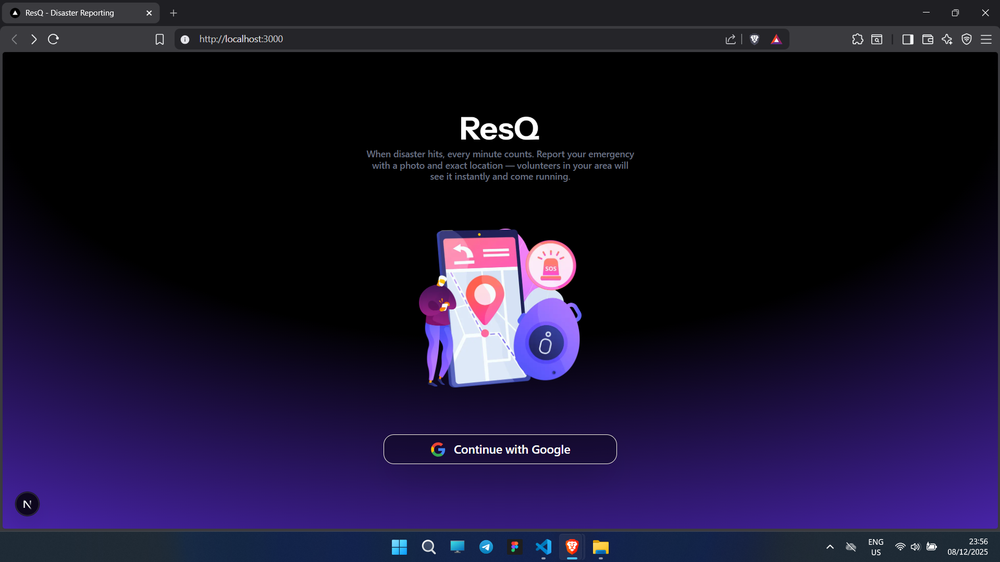
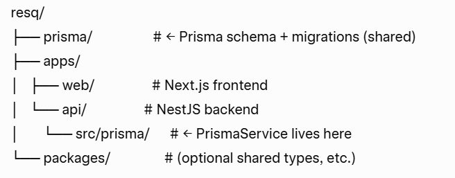
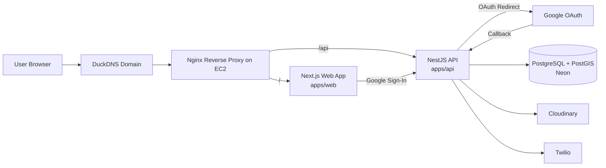

# ResQ

ResQ is a disaster-response platform built for Sri Lanka to connect victims and nearby volunteers quickly during floods, landslides, and other emergencies.



[](https://resq-disaster-platform-web.vercel.app)
[](https://github.com/nishmikaeka/resq-disaster-platform)

## Table of Contents

- [Motivation](#motivation)
- [What Problem It Solves](#what-problem-it-solves)
- [How It Works](#how-it-works)
- [Key Features](#key-features)
- [Tech Stack](#tech-stack)
- [Architecture Overview](#architecture-overview)
- [Project Structure](#project-structure)
- [Getting Started](#getting-started)
- [Environment Variables](#environment-variables)
- [Run and Test](#run-and-test)
- [Production Notes](#production-notes)
- [Roadmap](#roadmap)
- [Contributing](#contributing)
- [Credits](#credits)
- [License](#license)

## Motivation

During disasters, emergency hotlines can become overloaded. ResQ was built to provide a direct, map-based path between victims and volunteer responders, reducing response time and coordination friction.

## What Problem It Solves

- Victims can share their exact location, urgency, and media evidence quickly.
- Volunteers can discover nearby active incidents and accept response tasks.
- Victims receive SMS confirmation when help is on the way.

## How It Works

### Victim flow
1. Sign in with Google.
2. Create an incident (title, location, urgency, phone, optional media).
3. Wait for nearby volunteer acceptance.
4. Mark incident as resolved when safe.

### Volunteer flow
1. Sign in and open dashboard.
2. View nearby incidents on map and list.
3. Accept an open incident.
4. Coordinate with victim and complete response.

## Key Features

- Role-based experience for `VICTIM` and `VOLUNTEER`.
- Geospatial discovery with PostgreSQL + PostGIS.
- Live map interaction with draggable markers (Mapbox).
- Incident media upload support (Cloudinary).
- Twilio SMS notification when an incident is accepted.
- Secure cookie-based authentication with token refresh flow.
- Health checks, validation, global error handling, throttling, and cleanup cron.

## Tech Stack

- Frontend: Next.js 16, React 19, Tailwind CSS, Mapbox GL, Axios
- Backend: NestJS 11, Prisma, PostgreSQL (Neon), PostGIS
- Integrations: Google OAuth, Twilio, Cloudinary
- Monorepo: Turborepo + npm workspaces
- Deployment: AWS EC2 + Nginx + DuckDNS

## Architecture Overview

- `apps/web`: UI, incident reporting, dashboards, map experience.
- `apps/api`: auth, incidents, users, health, security, and background jobs.
- `packages/database`: Prisma schema/client generation and migrations.

## Project Structure



## Getting Started

### Prerequisites

- Node.js `>=18`
- npm `>=10`
- PostgreSQL database with PostGIS enabled

### Installation

```bash
git clone https://github.com/nishmikaeka/resq-disaster-platform.git
cd resq-disaster-platform
npm install
```

## Environment Variables

Create:
- `apps/web/.env.local`
- `apps/api/.env`

### `apps/web/.env.local`

```env
# Frontend runtime/public vars
NEXT_PUBLIC_API_URL=http://localhost:3001/api
NEXT_PUBLIC_BACKEND_URL=http://localhost:3001
NEXT_PUBLIC_MAPBOX_TOKEN=your_mapbox_public_token

# Optional (only if used by your current frontend auth flow)
NEXTAUTH_SECRET=your_nextauth_secret
NEXTAUTH_URL=http://localhost:3000

# Optional (only if referenced in frontend code)
NEXT_PUBLIC_CLOUDINARY_CLOUD_NAME=your_cloudinary_cloud_name
NEXT_PUBLIC_CLOUDINARY_API_KEY=your_cloudinary_api_key
```

### `apps/api/.env`

```env
PORT=3001
NODE_ENV=development
FRONTEND_URL=http://localhost:3000
BACKEND_URL=http://localhost:3001
SESSION_SECRET=your_long_random_session_secret
JWT_SECRET=your_long_random_jwt_secret

DATABASE_URL=your_postgres_connection_string

GOOGLE_CLIENT_ID=your_google_client_id
GOOGLE_CLIENT_SECRET=your_google_client_secret
CLOUDINARY_CLOUD_NAME=your_cloudinary_cloud_name
CLOUDINARY_API_KEY=your_cloudinary_api_key
CLOUDINARY_API_SECRET=your_cloudinary_api_secret

TWILIO_ACCOUNT_SID=your_twilio_sid
TWILIO_AUTH_TOKEN=your_twilio_auth_token
TWILIO_PHONE_NUMBER=+1xxxxxxxxxx
```

### Production values (EC2 + DuckDNS/Nginx)

Use these URL patterns in production:

```env
# apps/api/.env
NODE_ENV=production
PORT=3001
FRONTEND_URL=https://your-domain.duckdns.org
BACKEND_URL=https://your-domain.duckdns.org
```

```env
# apps/web/.env.local (or .env.production)
NEXT_PUBLIC_BACKEND_URL=https://your-domain.duckdns.org
NEXT_PUBLIC_API_URL=https://your-domain.duckdns.org/api
```

Notes:
- Keep real secrets out of git.
- Restart API with `pm2 restart resq-api --update-env` after API env changes.
- Rebuild web after `NEXT_PUBLIC_*` changes:
  - `npm run build --workspace=apps/web`
  - `pm2 restart resq-web --update-env`

## Run and Test

### Run both apps from monorepo root

```bash
npm run dev
```

### Run only API

```bash
npm run start:dev --workspace=apps/api
```

### Run only Web

```bash
npm run dev --workspace=apps/web
```

### Run API tests

```bash
npm run test --workspace=apps/api
```

## Production Notes

- Auth uses HttpOnly cookies for access and refresh tokens.
- Global throttling is enabled; avoid excessive duplicate client requests.
- Global validation and exception formatting are enabled.
- Health endpoint is available at `/api/health`.
- Daily cron cleanup removes incidents older than 7 days.
- Use strong secrets for `SESSION_SECRET` and `JWT_SECRET`.

## Product and Engineering Decisions

- **Fast sign-up under stress:** Google OAuth reduces friction so users can join quickly during emergencies.
- **Dark-first interface:** The dashboard uses a dark visual style for clearer map contrast at night and lower perceived battery drain on AMOLED devices.
- **Geo-first incident discovery:** Nearby incidents are resolved using location-based queries on PostgreSQL + PostGIS.
- **Scalable API protection:** Rate limiting (`@nestjs/throttler`) helps prevent abuse and accidental request storms.
- **Automatic data hygiene:** A scheduled cleanup job removes stale incidents to keep feeds relevant and queries efficient.
- **Production traffic routing:** Nginx acts as reverse proxy and process boundary for web/API routing on EC2.
- **Stable public endpoint:** DuckDNS provides a persistent domain mapped to EC2 for OAuth callback and API access.

## Infrastructure Snapshot

- **Compute:** Single AWS EC2 instance hosts both `apps/web` and `apps/api`.
- **Process management:** PM2 keeps services running and supports zero-downtime restarts.
- **Reverse proxy:** Nginx routes:
  - `https://<domain>/` -> Next.js web app
  - `https://<domain>/api` -> NestJS API
- **Domain:** DuckDNS dynamic DNS maps domain to the EC2 public IP.
- **Database:** PostgreSQL (Neon) with PostGIS for geospatial capabilities.

## Architecture Diagram


```mermaid
flowchart LR
    U[User Browser]
    D[DuckDNS Domain]
    N[Nginx Reverse Proxy on EC2]
    W[Next.js Web App\napps/web]
    A[NestJS API\napps/api]
    P[(PostgreSQL + PostGIS\nNeon)]
    C[Cloudinary]
    T[Twilio]
    G[Google OAuth]

    U --> D --> N
    N -->|/| W
    N -->|/api| A

    W -->|Google Sign-In| A
    A -->|OAuth Redirect| G
    G -->|Callback| A

    A --> P
    A --> C
    A --> T
```

## Roadmap

- Push notifications for responders
- Sinhala/Tamil localization
- AI-assisted triage and prioritization
- Admin dashboard and analytics
- Offline-friendly fallback flows

## Contributing

Contributions are welcome.

1. Fork the repository.
2. Create a feature branch.
3. Commit changes with clear messages.
4. Open a pull request with a concise description and test steps.

## Credits

- Project author: Nishmika Ekanayake
- Thanks to the open-source ecosystem around NestJS, Next.js, Prisma, and Mapbox

## License

This project is currently unlicensed (`UNLICENSED`). 
